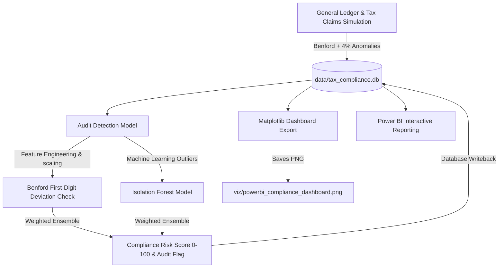

# Tax Anomaly Audit Pipeline 🔍🛡️

A modular, end-to-end Python and SQL compliance data engineering and analytics pipeline designed to detect tax evasion, data-entry errors, and anomalous accounting practices in corporate general ledgers. This repository implements statistical compliance audits utilizing **Benford's Law** first-digit distribution analysis coupled with an unsupervised **Isolation Forest** machine learning model.

---

## 🌟 Architecture Overview



---

## 📊 Core Audit Methodologies

### 1. Benford's Law (First-Digit Distribution)
Benford's Law (also called the First-Digit Law) is an empirical statistical principle describing the frequency distribution of leading digits in many real-life datasets. In financial transaction data, naturally occurring amounts (free from artificial thresholds, limits, or fraud) follow a logarithmic distribution where smaller digits are significantly more common as leading digits than larger ones:

$$P(d) = \log_{10}\left(1 + \frac{1}{d}\right)$$

| Leading Digit | Theoretical Probability |
| :---: | :---: |
| **1** | 30.1% |
| **2** | 17.6% |
| **3** | 12.5% |
| **4** | 9.7% |
| **5** | 7.9% |
| **6** | 6.7% |
| **7** | 5.8% |
| **8** | 5.1% |
| **9** | 4.6% |

Manual transaction manipulations, fake invoice submissions, and tax fraud schemes often violate Benford's Law by exhibiting an overrepresentation of high digits (e.g., $9,950$ or $8,900$) designed to bypass authorization thresholds. This pipeline calculates individual transaction risk scores based on the empirical overrepresentation of their first digits.

### 2. Isolation Forest Anomaly Detection
The **Isolation Forest** algorithm is an unsupervised machine learning algorithm for anomaly detection. Unlike typical classification or clustering algorithms that construct profiles of normal points and classify outliers as anything that doesn't fit, Isolation Forest explicitly isolates anomalies. 

- **How it works:** It recursively partitions data points using random feature splits. Because anomalies are rare and located far from the main clusters in feature space, they require far fewer partitions (shorter paths in the isolation trees) to isolate than normal points.
- **Features Analyzed:**
  - `amount`: Absolute value of the transaction.
  - `tax_claimed`: The tax value claimed on the transaction.
  - `tax_ratio`: The ratio of tax claimed to the transaction amount ($tax\_claimed / amount$).
  - `dept_amount_ratio`: The ratio of the transaction amount compared to the department's average spend.
- The pipeline scores anomalies in the range $[0, 1]$ based on path length and scales this into a combined Compliance Risk Score.

### 3. Combined Compliance Risk Score
The final **Compliance Risk Score (0-100)** is computed as a weighted ensemble:
$$\text{Compliance Risk Score} = (0.30 \times \text{Benford Score} + 0.70 \times \text{Isolation Forest Score}) \times 100$$
Transactions with a combined score $\ge 65$ are flagged with `audit_flag = 1` for immediate forensic investigation.

---

## 📁 Repository Structure

- [README.md](file:///g:/Tax-Anomaly-Audit-Pipeline/README.md): Systems documentation and methodologies.
- [requirements.txt](file:///g:/Tax-Anomaly-Audit-Pipeline/requirements.txt): Python dependencies.
- [db/schema.sql](file:///g:/Tax-Anomaly-Audit-Pipeline/db/schema.sql): SQLite schema initializing the `general_ledger` and `tax_claims` tables.
- [db/queries.sql](file:///g:/Tax-Anomaly-Audit-Pipeline/db/queries.sql): Forensic SQL queries to analyze audit scores by department, top flagged claims, monthly trends, and first-digit counts.
- [etl/audit_etl.py](file:///g:/Tax-Anomaly-Audit-Pipeline/etl/audit_etl.py): Generates 1,200 transactions. Benford-conforming amounts are simulated via $10^U$ (where $U \sim \text{Uniform}$). Skewed values (3-5%) are injected to simulate unauthorized manual adjustments and fraudulent tax claims.
- [models/audit_detection.py](file:///g:/Tax-Anomaly-Audit-Pipeline/models/audit_detection.py): Implements the first-digit probability analyzer and Isolation Forest classifier, updates the database, and prints diagnostic results.
- [viz/dashboard_export.py](file:///g:/Tax-Anomaly-Audit-Pipeline/viz/dashboard_export.py): Generates a dark-gold themed compliance dashboard and saves it to [viz/powerbi_compliance_dashboard.png](file:///g:/Tax-Anomaly-Audit-Pipeline/viz/powerbi_compliance_dashboard.png).

---

## 🚀 Getting Started

### 1. Installation
Clone this repository and install the dependencies:
```bash
pip install -r requirements.txt
```

### 2. Execute the Pipeline
Run the ETL script to generate the database:
```bash
python etl/audit_etl.py
```

Run the ML detection model to score and flag transactions:
```bash
python models/audit_detection.py
```

Export the compliance visualization dashboard:
```bash
python viz/dashboard_export.py
```

---

## 📈 Power BI Integration

To load the ledger transactions and audited compliance risk flags directly into Power BI:

### Option A: Import via SQLite ODBC Driver (Recommended for live queries)
1. Install the **SQLite ODBC Driver** (e.g., from [http://www.ch-werner.de/sqliteodbc/](http://www.ch-werner.de/sqliteodbc/)).
2. Open **Power BI Desktop**.
3. Select **Get Data** -> **ODBC**.
4. In the Connection String field, enter:
   ```odbc
   Driver={SQLite3 ODBC Driver};Database=G:\Tax-Anomaly-Audit-Pipeline\data\tax_compliance.db;
   ```
5. Select tables `general_ledger` and `tax_claims` to import.
6. Manage relationships by linking `general_ledger.entry_id` (1) to `tax_claims.entry_id` (1) with a 1-to-1 relationship.

### Option B: Import via Python Script (Quickest)
1. In **Power BI Desktop**, go to **Get Data** -> **Python script**.
2. Paste the following script:
   ```python
   import sqlite3
   import pandas as pd
   
   conn = sqlite3.connect(r"G:\Tax-Anomaly-Audit-Pipeline\data\tax_compliance.db")
   general_ledger = pd.read_sql_query("SELECT * FROM general_ledger", conn)
   tax_claims = pd.read_sql_query("SELECT * FROM tax_claims", conn)
   conn.close()
   ```
3. Click **OK**, select the two tables, and click **Load**.
